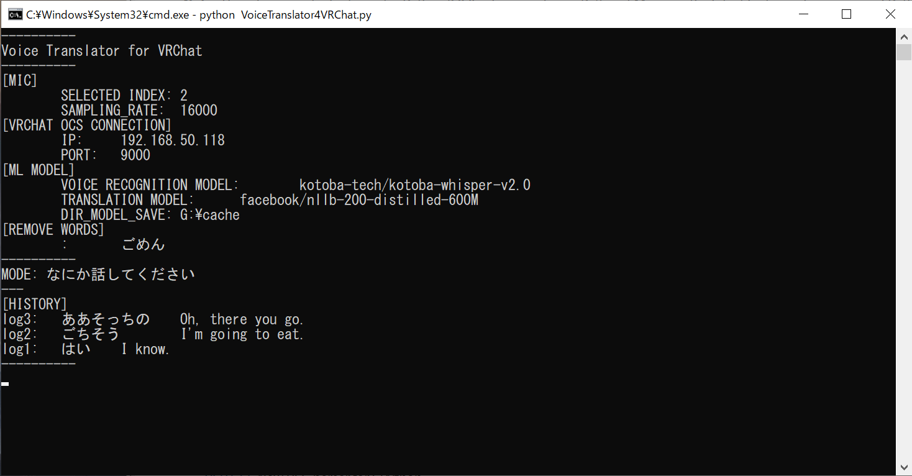

思考時間: 5 秒

# Voice Translator for VRChat — 日本語 README

リアルタイムで **日本語音声 → 文字起こし（Whisper） → 英語翻訳（NLLB‑200） → VRChat のチャットボックスへ OSC 送信** を行う軽量 Python ユーティリティです。

------

## ✨ 主な機能

| 機能             | 詳細                                                   |
| ---------------- | ------------------------------------------------------ |
| 🎙️ 音声認識       | [**`kotoba‑tech/kotoba‑whisper‑v2.0`**](https://huggingface.co/kotoba-tech/kotoba-whisper-v2.0) による日本語 STT |
| 🌐 翻訳           | [**facebook/nllb‑200‑distilled‑600M**](https://huggingface.co/facebook/nllb-200-distilled-600M) (200言語対応)     |
| 🔌 OSC 出力       | `/chatbox/input` へ UDP 送信し VRChat で即表示         |
| 📝 コンソール履歴 | 直近 *N* 行をターミナルに保持 (`LOG_HISTORY_SIZE`)     |
| ⚙️ 簡単設定       | すべてのパラメータが大文字定数に集約                   |

------

## 📦 必要環境

- **Python 3.9 以上**
- **PyTorch**（GPU, CUDA 推奨）
- **同一 LAN 上** で OSC を有効化した VRChat クライアント
- 追加 Python パッケージ：

```bash
pip install numpy soundfile SpeechRecognition torch python-osc transformers
```

------

## 🔧 セットアップ手順

1. **リポジトリを取得**

   ```bash
   git clone https://github.com/your‑username/voice‑translator‑vrchat.git
   cd voice‑translator‑vrchat
   ```

2. **依存ライブラリをインストール**（venv / conda 推奨）。

3. **`VoiceTranslator4VRChat_refact.py` 冒頭の定数を編集**

| 定数名 | 既定値 | 備考 |
|--------|--------|------|
| `MIC_DEVICE_INDEX` | `2` | 使用するマイクデバイスのインデックス |
| `MIC_SAMPLE_RATE` | `16_000` | マイクのサンプリングレート (Hz) |
| `VRC_IP` | `"192.168.50.118"` | VRChat OSCサーバのIPアドレス |
| `VRC_PORT` | `9000` | VRChat OSCサーバのポート番号 |
| `CHATBOX_INPUT_ADDRESS` | `"/chatbox/input"` | チャットボックスへのOSCアドレス |
| `MODEL_ID_WHISPER` | `"kotoba-tech/kotoba-whisper-v2.0"` | 音声認識モデルID |
| `MODEL_ID_TRANSLATION` | `"facebook/nllb-200-distilled-600M"` | 翻訳モデルID |
| `CACHE_PATH` | `r"G:\cache"` | Hugging Faceモデルキャッシュ保存先 |
| `REMOVE_WORDS` | `["ごめん"]` | 無音誤検知時に除外する単語 |
| `TRANSLATION_MAX_LENGTH` | `30` | 翻訳出力の最大トークン長 |
| `LOG_HISTORY_SIZE` | `3` | コンソールに保持する履歴行数 |
| `DEVICE` | `"cuda" if torch.cuda.is_available() else "cpu"` | 推論を実行するデバイス（条件式のため動的に決定） |


4. **OSC 動作確認（任意）**：VRChat で `Ctrl + F1` を押し、OSC デバッガで受信メッセージを確認。

------

## 🚀 使い方

```bash
python VoiceTranslator4VRChat.py
```

1. 設定内容を示すバナーが表示されます。
2. マイクに向かって日本語で話すと、
3. 約 1 秒以内に JP→EN 両行が VRChat チャットボックスへ送信され、コンソールにも履歴が表示されます。
4. 終了は `Ctrl +C`。



------

## 🛠️ 内部処理フロー

```text
マイク入力
   │
   ▼
Whisper (日本語 STT) ──► JP テキスト
   │
   ▼
NLLB‑200 (JA→EN 翻訳) ──► EN テキスト
   │
   ▼
OSC (/chatbox/input) ──► VRChat
```

STT・翻訳モデルはローカル推論のみ。送信されるのは短い UDP パケットのみです。 

------

## 📚 拡張アイデア

- **多言語対応** — `src_lang` / `forced_bos_token_id` を変更。
- **プッシュトゥトーク** — 録音ブロックをキーリスナー付きでラップ。
- **GUI 化** — PySimpleGUI や Eel で簡易コントロールパネルを実装。

------

## ⚠️ 既知の制限

- 標準では **日→英** のみ
- 設定はコード内定数のみ（`.env` 未対応）
- `TRANSLATION_MAX_LENGTH` を超える長文は切り捨て
- 無音区間があると音声認識範囲がそこで途切れ、翻訳もその範囲内の音声認識結果に限定されます。

------

## 🤝 コントリビューション

Issue / PR 大歓迎です！大きな変更は事前に Issue でご相談ください。

------

## 📄 ライセンス

MIT (詳細は `LICENSE` を参照)
